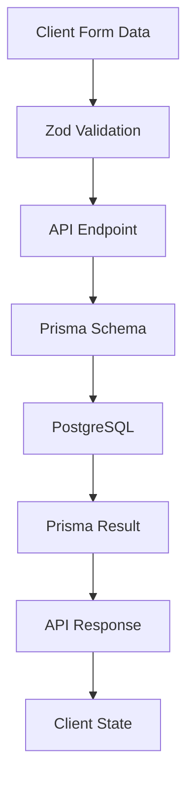

# CPT Group - Member Management System

A modern, full-stack Next.js application for managing class action lawsuit member data. Built with scalability, concurrent access control, and user experience in mind, this application demonstrates efficient CRUD operations, responsive design, and real-time collaboration features.

## 💫 Live Demo

Visit the live application at [https://cptapp.netlify.app](https://cptapp.netlify.app)

## 🎯 Key Features

- ✨ **Intuitive Interface**
  - Clean, modern UI with responsive design
  - Interactive data tables with sorting and filtering
  - Real-time feedback and loading states
  - Toast notifications for user actions

- 🔍 **Advanced Search Capabilities**
  - Multi-field search functionality
  - Filter by name, contact info, or location
  - Instant search results
  - Clear error handling and feedback

- 📊 **Data Management**
  - Create, read, update, and delete member records
  - Bulk import via CSV files
  - Data validation and error handling
  - Optimistic updates for better UX

- 🔒 **Concurrent Access Control**
  - Version control for member records
  - Optimistic locking to prevent data conflicts
  - Record-level locking for concurrent edits
  - Automatic conflict resolution
  - User tracking for modifications

## 🚀 Technical Stack

- **Frontend**
  - Next.js 13+ with App Router
  - React (Client Components)
  - TailwindCSS for styling
  - TypeScript for type safety
  - PrimeReact UI components

- **Backend**
  - Next.js API Routes
  - Prisma ORM
  - PostgreSQL
  - Zod schema validation

## 📋 Prerequisites

| Requirement | Version |
|------------|---------|
| Node.js    | >= 18.0.0 |
| npm        | >= 9.0.0  |
| PostgreSQL | >= 14.0.0 |

## 🛠️ Local Development Setup

1. **Clone the repository**
   ```bash
   git clone https://github.com/XYIAN/cpt-example.git
   cd cpt-example
   ```

2. **Install dependencies**
   ```bash
   npm install
   ```

3. **Set up your environment**
   - Create a `.env` file in the project root:
     ```env
     DATABASE_URL="your-postgresql-url"
     ```

4. **Initialize the database**
   ```bash
   npx prisma generate
   npx prisma db push
   ```

5. **Import sample data**
   ```bash
   npx tsx scripts/import-csv.ts
   ```

6. **Start the development server**
   ```bash
   npm run dev
   ```

   Visit [http://localhost:3000](http://localhost:3000) to see the application.

## 📁 Project Structure

```
cpt-example/
├── src/
│   ├── app/              # Next.js app directory and API routes
│   ├── components/       # React components
│   ├── contexts/         # React contexts (Toast, etc.)
│   ├── lib/             # Utility functions and Prisma client
│   └── types/           # TypeScript type definitions
├── prisma/              # Prisma schema and migrations
├── data/               # CSV data files
└── scripts/            # Data import scripts
```

## 🔄 Data Import

The application uses two CSV files for member data:
- `Members1.csv`: Basic member info and purchase data
- `Members2.csv`: Additional member details and coverage info

To import data:
1. Ensure your CSV files are in the `data/` directory
2. Run the import script:
   ```bash
   npx tsx scripts/import-csv.ts
   ```

## 📝 API Routes

| Endpoint | Method | Description |
|----------|--------|-------------|
| `/api/members` | GET | Fetch all members |
| `/api/members` | POST | Create new member |
| `/api/members/:id` | GET | Get member details |
| `/api/members/:id` | PUT | Update member (with version control) |
| `/api/members/:id` | DELETE | Delete member |

## 🔒 Version Control

The system implements optimistic locking and record-level locking:

- Each record has a version number that increments on updates
- Records can be locked for exclusive access
- Version conflicts are detected and handled gracefully
- Users are notified of concurrent edit attempts
- Modification history is tracked with user information

## 👥 Multi-User Handling & Concurrency

The application implements a robust system to handle multiple users accessing and modifying data simultaneously:

### Conflict Prevention
- **Optimistic Locking**
  - Each member record maintains a version number
  - Version is automatically incremented on each update
  - Updates check if version matches before applying changes
  - Prevents unintended overwrites of concurrent modifications

- **Record-Level Locking**
  - Records are locked when a user starts editing
  - Other users are prevented from editing locked records
  - Locks automatically expire after inactivity
  - Lock status is visible in the UI

### Real-Time Feedback
- **Version Conflict Detection**
  - Immediate notification when version mismatch occurs
  - Clear explanation of the conflict situation
  - Option to refresh and get latest version
  - Prevents data loss from concurrent edits

- **Lock Status Indicators**
  - Visual indicators for locked records
  - Shows which records are being edited
  - Displays lock holder information
  - Automatic UI updates when lock status changes

### Error Handling
- **Conflict Resolution**
  - Automatic detection of stale data
  - User-friendly conflict resolution workflow
  - Option to merge changes or override
  - Preservation of audit trail

- **Edge Cases**
  - Handles network disconnections gracefully
  - Automatic lock release on session timeout
  - Recovery from interrupted operations
  - Consistent state maintenance

### User Experience
- **Notifications**
  - Toast messages for operation status
  - Clear feedback on action success/failure
  - Informative error messages
  - Guidance for conflict resolution

- **UI State Management**
  - Loading indicators during operations
  - Disabled controls for locked records
  - Clear visual feedback
  - Responsive interface updates

### Data Integrity
- **Audit Trail**
  - Tracks all modifications
  - Records user information
  - Timestamps for all changes
  - Version history maintenance

- **Validation**
  - Server-side data validation
  - Type checking with Zod
  - Required field enforcement
  - Data format verification

### Implementation Details
- **Database Level**
  ```sql
  -- Member table includes:
  version         INT       -- For optimistic locking
  isLocked       BOOLEAN   -- Current lock status
  lastModifiedBy STRING    -- User tracking
  updatedAt      DATETIME  -- Modification timestamp
  ```

- **API Layer**
  ```typescript
  // Update endpoint includes:
  if (existingMember.version !== requestVersion) {
    throw new VersionConflictError();
  }
  if (existingMember.isLocked) {
    throw new RecordLockedError();
  }
  ```

- **Client Side**
  ```typescript
  // Edit workflow:
  1. Check lock status
  2. Acquire lock
  3. Load current version
  4. Make changes
  5. Submit with version
  6. Handle any conflicts
  7. Release lock
  ```

## 📊 Data Schema & Type System

The application implements a layered type system to ensure data consistency from database to client:

### Database Schema (Prisma)
```prisma
model Member {
  // Primary Key
  id            Int      @id @default(autoincrement())

  // Basic Information
  firstName     String
  lastName      String
  email         String?
  
  // Contact Details
  homePhone     String?
  mobilePhone   String?
  
  // Address Information
  address1      String?
  address2      String?
  city          String?
  state         String?
  zip           String?
  zip4          String?
  
  // Product Information
  productName   String?    // From Members1.csv
  datePurchased DateTime?  // From Members1.csv
  paidAmount    Float?     // From Members1.csv
  
  // Coverage Information
  coveredWeeks   Float?    // From Members2.csv
  lastStateWorked String?  // From Members2.csv
  
  // Version Control & Concurrency
  version        Int      @default(1)
  isLocked       Boolean  @default(false)
  lastModifiedBy String?
  
  // Timestamps
  createdAt      DateTime @default(now())
  updatedAt      DateTime @updatedAt

  // Indexes for Performance
  @@index([lastName])
  @@index([email])
  @@index([mobilePhone])
}
```

### API Validation (Zod)

#### Create Member Schema
```typescript
const MemberInput = z.object({
  // Required Fields
  firstName: z.string(),
  lastName: z.string(),
  
  // Optional Contact Info
  email: z.string().optional().nullable(),
  homePhone: z.string().optional().nullable(),
  mobilePhone: z.string().optional().nullable(),
  
  // Optional Address
  address1: z.string().optional().nullable(),
  address2: z.string().optional().nullable(),
  city: z.string().optional().nullable(),
  state: z.string().optional().nullable(),
  zip: z.string().optional().nullable(),
  zip4: z.string().optional().nullable(),
  
  // Optional Product Info
  productName: z.string().optional().nullable(),
  datePurchased: z.string().optional().nullable(),
  paidAmount: z.number().optional().nullable(),
  
  // Optional Coverage Info
  coveredWeeks: z.number().optional().nullable(),
  lastStateWorked: z.string().optional().nullable()
});
```

#### Update Member Schema
```typescript
const MemberUpdateInput = MemberInput.extend({
  // Version Control Fields
  version: z.number(),
  isLocked: z.boolean().optional(),
  lastModifiedBy: z.string().optional().nullable()
});
```

### Type System Layers

| Layer | Technology | Purpose | Example |
|-------|------------|---------|---------|
| Database | Prisma Schema | Define database structure | `model Member { ... }` |
| ORM | Prisma Client | Type-safe database queries | `prisma.member.findUnique()` |
| Validation | Zod | Runtime data validation | `MemberInput.parse(data)` |
| API | TypeScript | Type definitions for API | `type Member = { ... }` |
| Client | TypeScript | Frontend type safety | `const [member, setMember] = useState<Member>()` |

### Data Flow & Validation



### Type Safety Features

1. **Database Level**
   - Strong field types
   - Required vs optional fields
   - Default values
   - Indexes for performance
   - Foreign key constraints

2. **API Level**
   - Input validation
   - Runtime type checking
   - Error handling
   - Data transformation

3. **Client Level**
   - Form validation
   - Type inference
   - Compile-time checks
   - Auto-completion

This layered approach ensures:
- Data consistency across the stack
- Runtime safety with validation
- Compile-time type checking
- Clear error messages
- Maintainable codebase

## 🤝 Contributing

1. Fork the repository
2. Create your feature branch (`git checkout -b feature/AmazingFeature`)
3. Commit your changes (`git commit -m 'Add some AmazingFeature'`)
4. Push to the branch (`git push origin feature/AmazingFeature`)
5. Open a Pull Request

## 📄 License

This project is licensed under the MIT License - see the [LICENSE](LICENSE) file for details.

---
Built with ❤️ by [Kyle Dilbeck](https://github.com/xyian)
